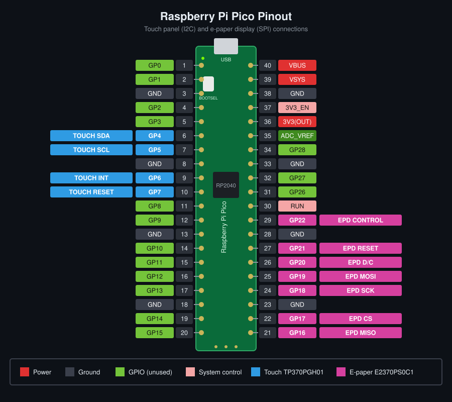

# Pico touch + fast-update e-paper example

A Raspberry Pi Pico example that shows how to use a touch-enabled e-paper
panel: fast display updates driven from a framebuffer, and touch input
turned into press / move / hold / release events. A home menu with three pages
leads to fourteen demonstrations.

## Hardware

| Part    | Device                                                    | Interface                          |
|---------|-----------------------------------------------------------|------------------------------------|
| Display | Pervasive Displays E2370PS0C1, 3.70", 240 x 416, black/white, UC8253c controller | SPI + CS, DC, RESET, BUSY |
| Touch   | Pervasive Displays TP370PGH01 capacitive overlay          | I2C (0x38) + INT, RESET            |
| Board   | Raspberry Pi Pico (RP2040); Pico 2 by selecting that board | 3.3 V logic                      |

**Fast-update display.** E-paper normally flashes the whole panel when the
picture changes. The E2370PS0C1 also has a fast update waveform: the
controller is given the previous and the new image and changes only what
differs, which is quicker and flashes less. The cost is faint ghosting that
accumulates, so the example uses a global (flashing) update to clean up when
you return to the menu. Both modes redraw the whole screen; there is no
partial-window update.

**Touch panel.** The overlay reports one finger at a time. The controller
asserts INT while it has a report; the driver reads a report only while INT is
asserted, and `touch/touch.c` turns the reports into events in display
coordinates.

## Wiring

All pin numbers are in [`board/board_config.h`](board/board_config.h); change
them there to match your wiring. The defaults are:

| Signal         | Pico GPIO | Notes                                                 |
|----------------|-----------|-------------------------------------------------------|
| SPI0 SCK       | GP18      |                                                       |
| SPI0 MOSI      | GP19      | panel SDI                                             |
| SPI0 MISO      | GP16      | wire to the same SDI line as MOSI (reads panel OTP)   |
| EPD CS         | GP17      | active low                                            |
| EPD DC         | GP20      |                                                       |
| EPD RESET      | GP21      |                                                       |
| EPD BUSY       | GP22      | low while the panel is busy                           |
| Touch SDA/SCL  | GP4 / GP5 | I2C0                                                  |
| Touch INT      | GP6       | active low                                            |
| Touch RESET    | GP7       | active low                                            |

```text
                         ┌───────[ USB ]───────────┐
                         │      RASPBERRY PI       │
                         │          PICO           │
                         │                         │
  1  GP0  ───────────────┤ ○                     ○ ├────────────── 40  VBUS
  2  GP1  ───────────────┤ ○                     ○ ├────────────── 39  VSYS
  3  GND  ───────────────┤ ○                     ○ ├────────────── 38  GND
  4  GP2  ───────────────┤ ○                     ○ ├────────────── 37  3V3_EN
  5  GP3  ───────────────┤ ○                     ○ ├────────────── 36  3V3
  6  GP4  ── TOUCH SDA ──┤ ○                     ○ ├────────────── 35  ADC_VREF
  7  GP5  ── TOUCH SCL ──┤ ○                     ○ ├────────────── 34  GP28
  8  GND  ───────────────┤ ○                     ○ ├────────────── 33  GND
  9  GP6  ── TOUCH INT ──┤ ○                     ○ ├────────────── 32  GP27
 10  GP7  ─ TOUCH RESET ─┤ ○                     ○ ├────────────── 31  GP26
 11  GP8  ───────────────┤ ○                     ○ ├────────────── 30  RUN
 12  GP9  ───────────────┤ ○                     ○ ├── EPD BUSY ─ 29  GP22
 13  GND  ───────────────┤ ○                     ○ ├────────────── 28  GND
 14  GP10 ───────────────┤ ○                     ○ ├──── EPD RESET ── 27  GP21
 15  GP11 ───────────────┤ ○                     ○ ├── EPD D/C ─── 26  GP20
 16  GP12 ───────────────┤ ○                     ○ ├── EPD MOSI ──── 25  GP19
 17  GP13 ───────────────┤ ○                     ○ ├── EPD SCK ───── 24  GP18
 18  GND  ───────────────┤ ○                     ○ ├────────────── 23  GND
 19  GP14 ───────────────┤ ○                     ○ ├── EPD CS ───── 22  GP17
 20  GP15 ───────────────┤ ○                     ○ ├── EPD MISO ────── 21  GP16
                         │                         │
                         │       ┌─────────┐       │
                         │       │  RP2040 │       │
                         │       └─────────┘       │
                         │                         │
                         └─────────────────────────┘
```



The on-board LED (`PICO_DEFAULT_LED_PIN`) is used as a diagnostic; see below.

`DISPLAY_ROTATION` in the same file sets the screen orientation for both
drawing and touch. The demos are laid out for landscape (1 or 3).

## Building

The project uses the Raspberry Pi Pico SDK (C). With `PICO_SDK_PATH` set:

```
mkdir build && cd build
cmake ..
make
```

Copy `pico_epaper_touch.uf2` to the Pico in BOOTSEL mode. Status messages are
printed on the USB serial port.

## Demonstrations

Tap a tile on the home menu (PREV / NEXT change page); the HOME button in each
screen's header returns to the menu.

| Page        | Demo           | Shows                                                              |
|-------------|----------------|--------------------------------------------------------------------|
| 1 Input     | Touch test     | Live event name, display and raw coordinates, marker, corner targets |
|             | Number keypad  | Touch regions: keypad with entry field and ENTER                   |
|             | Text keyboard  | On-screen QWERTY with DEL, SPACE, CLR and ENTER                    |
|             | Scribble       | Free-hand drawing; the panel refreshes when the finger lifts       |
|             | Gestures       | Tap, double tap, long press and swipe recognition                  |
|             | List           | Scrolling list with paging, selection and a confirm dialog         |
| 2 Apps      | Tic-tac-toe    | One or two players; turn-based play suits the slow panel           |
|             | Handwriting    | Draw a digit or capital letter, recognise it, teach it corrections |
|             | Settings       | Flip display, pen size, fast/global update, debounce, long press, panel clean, auto clean |
|             | Sleep          | Idle with the touch interrupt armed; touch to wake                 |
|             | System info    | Screen and panel size, touch controller, pins, refresh counter     |
| 3 Diagnostics | Touch diag   | INT level, controller counters, raw report, sample rate, I2C scan  |
|             | Accuracy grid  | Nine targets; measured error and mean offset of your taps          |
|             | Refresh bench  | Six timed full refreshes in the selected update mode               |

Run the refresh bench once with FAST UPDATE on and once off (Settings, page 2)
to compare the two update modes.

## Status LED

The Pico's on-board LED reports what the hardware is doing
([`board/status_led.h`](board/status_led.h)):

| LED                                  | Meaning                                              |
|--------------------------------------|------------------------------------------------------|
| On while a finger is on the panel    | Touch controller, INT line and events are working    |
| 2 blinks, repeating                  | E-paper panel failed to initialize                   |
| 3 blinks at start-up                 | Touch controller did not answer on I2C               |
| 5 blinks after a screen change       | A display refresh failed or timed out (BUSY, RESET, SPI) |

Boards whose LED is on the wireless chip (Pico W, Pico 2 W) have no
GPIO-driven LED, and the LED calls do nothing there.

## Project structure

```
board/board_config.h     pins, SPI/I2C instances, bus speeds, display rotation
board/status_led.[ch]    diagnostic use of the on-board LED
display/
  epd_hw.[ch]            SPI framing, RESET and BUSY lines
  epd.[ch]               UC8253c driver: framebuffer, fast and global refresh
  gfx.[ch], font5x7.[ch] drawing primitives and text (logical, rotated coordinates, flip)
touch/
  tp370.[ch]             TP370PGH01 controller: I2C, INT, RESET, raw samples
  touch.[ch]             events, coordinate rotation, debounce, long press, counters
ui/
  ui.[ch]                screen manager, settings, event queue, refresh loop, widgets
  menu.[ch]              three-page home menu
demos/                   one file per demonstration, declared in demos.h
demos/recog/             handwriting recognizer used by the Handwriting demo
src/main.c               initialization only
```

* **Display driver:** `display/epd.c`. Draw with `display/gfx.h`, then call
  `epd_refresh(EPD_UPDATE_FAST)` or `epd_refresh(EPD_UPDATE_GLOBAL)`.
* **Touch driver:** `touch/tp370.c` talks to the controller;
  `touch/touch.c` provides the events. To use a different touch controller,
  replace `tp370.c` with a driver offering the same four functions.
* **Demos:** `demos/`. A demo is a `struct ui_screen` (`enter`, `draw`,
  `touch`, optional `refreshed`).

### Adding a demo

1. Create `demos/demo_xyz.c` defining a `struct ui_screen`.
2. Declare it in `demos/demos.h`.
3. Add the file to `CMakeLists.txt`.
4. Add a line to the tile table in `ui/menu.c`, naming the home page it belongs on.

## How a refresh works

Screens draw into the framebuffer and call `ui_redraw()`. The UI then clears
the buffer, draws the header and the screen, and refreshes the panel. A
refresh takes a moment, so touch events that arrive during it are queued and
handled afterwards; redraw requests made meanwhile are served by one refresh.
The display driver calls back about once a millisecond while it waits for the
panel, which is how touch is still sampled during a refresh.

## Notes and limitations

* The built-in handwriting templates are generated by
  `demos/recog/gen_templates.py`; edit the script, not the generated file.
* The panel's first update after power-up, and any update after a failed one,
  is global, because the image on the glass is then unknown.
* The panel temperature is a fixed value (`EPD_TEMPERATURE_C` in
  `display/epd.c`); fast update is only used between 15 and 30 C.
* The global update reuses the image layout of Pervasive's film C global
  flow, since Pervasive publishes no global flow for this film.
* The pin assignments and the 100 kHz I2C clock are example defaults.
